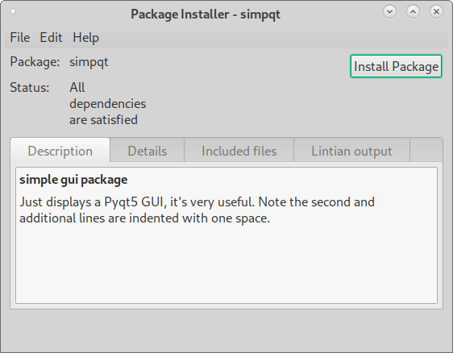
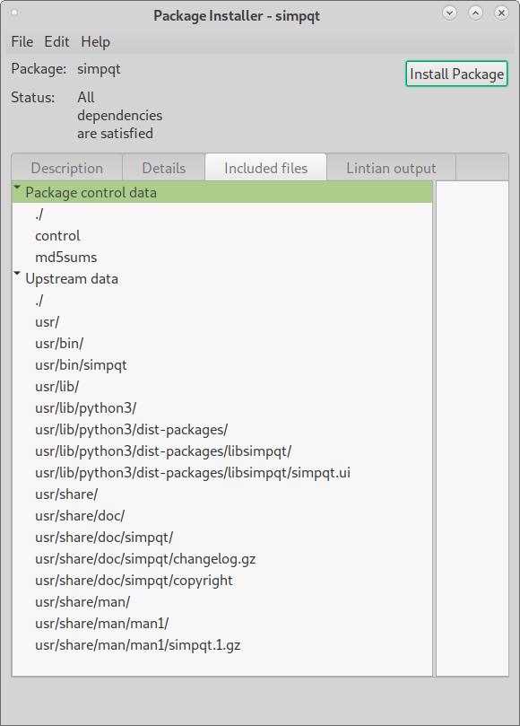
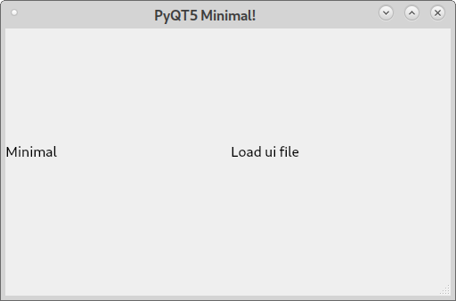
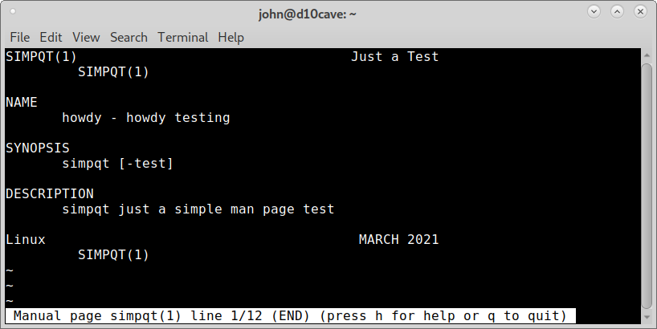

Building the deb
================

In the simpqt-0.0.1 directory of the program in this case it's a 
subdirectory of gui-deb open a terminal and build the deb with the
following command.
::

	dpkg-buildpackage -us -uc

To check the deb file open a terminal in the gui-deb directory and
use lintian to verify. Use the command `ls` to list the files so you can
copy and paste the file name instead of typing it out.
::

	john@d10cave:~/gui-deb$ ls
	simpqt-0.0.1                  simpqt_0.0.1_amd64.changes  simpqt_0.0.1.dsc
	simpqt_0.0.1_amd64.buildinfo  simpqt_0.0.1_amd64.deb      simpqt_0.0.1.tar.xz
	john@d10cave:~/gui-deb$ lintian simpqt_0.0.1_amd64.deb
	john@d10cave:~/gui-deb$ 

If there are no errors then nothing is displayed.

Right click on the deb and open with Gdebi.

You can see what files will be installed where on the `Included files`
tab.

You can install the deb then open a terminal and type in simpqt to see
the program is installed and works.

You can also type in man simpqt to see the man page.

