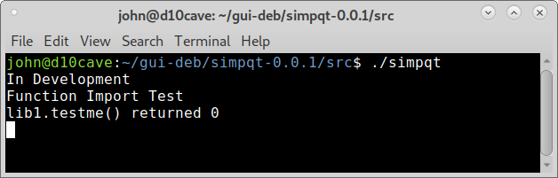
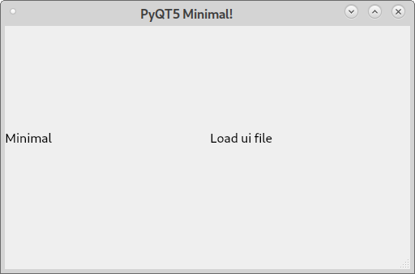

Importing Library
=================

Add the subdirectory `libsimpqt` to simpqt-0.0.1/src for our library
file. Add a `lib1.py` file to the libsimpqt directory.

.. Note:: all the files that `dpkg-buildpackage` creates have been
	removed for clarity.

::

	john@d10cave:~/gui-deb$ tree
	.
	└── simpqt-0.0.1
	    ├── debian
	    │   ├── changelog
	    │   ├── compat
	    │   ├── control
	    │   ├── copyright
	    │   ├── install
	    │   ├── manpages
	    │   ├── rules
	    │   └── source
	    │       └── format
	    ├── man
	    │   └── simpqt.1
	    ├── Simple PyQt5.desktop
	    └── src
	        ├── libsimpqt
	        │   └── lib1.py
	        ├── simpqt
	        └── simpqt.ui

	6 directories, 13 files

lib1.py
-------
::

	def testme():
		print('Function Import Test')
		return 0

simpqt
------

Modifications to the original `simpqt` file to import the library and
test the import by calling the function.
::

	#!/usr/bin/python3

	import sys, os
	from PyQt5.QtWidgets import QApplication, QMainWindow
	from PyQt5 import uic
	from libsimpqt import lib1

	if os.path.split(sys.argv[0])[0] == '/usr/bin':
		GUI_PATH = '/usr/lib/python3/dist-packages/libsimpqt'
		print('Installed')

	if os.path.split(sys.argv[0])[0] == '.':
		GUI_PATH = os.path.split(os.path.realpath(sys.argv[0]))[0]
		print('In Development')

	# test that the import worked
	print(f'lib1.testme() returned {lib1.testme()}')

	class main(QMainWindow):
		def __init__(self):
			super().__init__()
			path, filename = os.path.split(os.path.realpath(__file__))
			uic.loadUi(os.path.join(GUI_PATH, 'simpqt.ui'), self)
			self.setGeometry(50, 50, 500, 300)
			self.setWindowTitle("PyQT5 Minimal!")
			self.show()

	if __name__ == '__main__':
		app = QApplication(sys.argv)
		gui = main()
		sys.exit(app.exec_())

install
-------

Add the installation location for the library file in the format `file`
space `location`.
::

	src/simpqt usr/bin
	src/simpqt.ui usr/lib/python3/dist-packages/libsimpqt
	*.desktop usr/share/applications
	src/libsimpqt/*.* usr/lib/python3/dist-packages/libsimpqt

Open a terminal in the `simpqt-0.0.1/src` directory and test the program.
The `./` means look in this directory for the executable file in linux.

As you can see the import of the library worked and it printed out to
the terminal as expected.

Build the deb
-------------

As before open a terminal in the `simpqt-0.0.1` directory and use
::

	dpkg-buildpackage -us -uc

In the `gui-deb` directory right click on the deb and open with Gdebi
and install.

Run from the Applications > Accessories menu or from a terminal with the
command `simpqt`.

